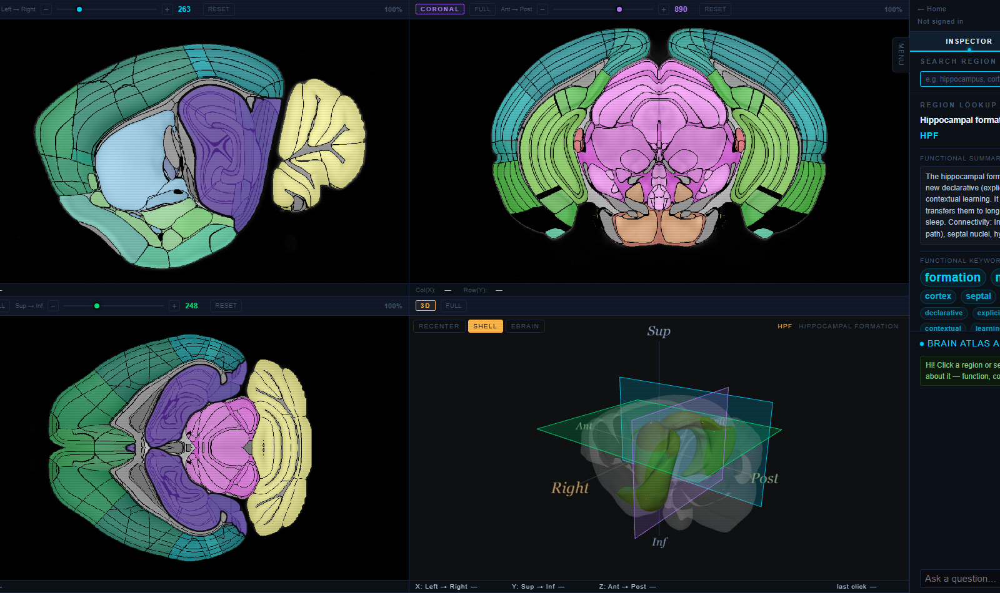
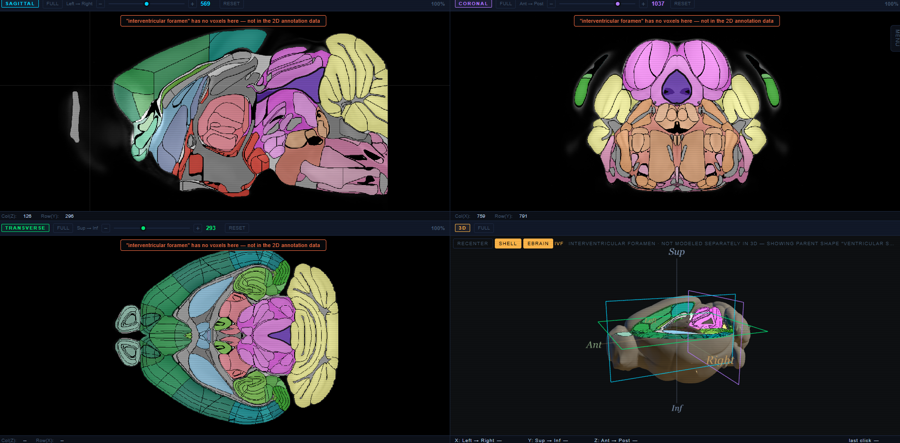

# Brain Atlas Explorer

An interactive explorer for the Allen Institute's CCFv3 mouse brain atlas: four synced views (sagittal, coronal, transverse, and a full 3D mesh viewer), region search across both individual structures and whole anatomical groups, the complete Allen ontology as a browsable tree, and an AI assistant that can answer questions about whatever region is currently selected.



## Features

### Four synced views
- **2D slice views** (sagittal / coronal / transverse) — the annotated CCFv3 volume, colorized by region, with independent zoom/pan per view and click-to-identify on any pixel.
- **3D mesh viewer** — loads the clicked structure's actual mesh, with live slice planes showing exactly where the three 2D views currently sit in 3D space.
- **eBrain mode** — an alternate 3D rendering mode: the three slice planes get the real slice image textured onto them, plus an octant cutaway of the brain so you can see the planes intersecting the volume from any angle.
- Selecting a region from *any* view (a 2D click, a 3D click, search, or the hierarchy tree) syncs all the others to match.

### Search
- Look up a region by name or acronym.
- Finds whole anatomical **groups** too (e.g. searching "Isocortex" or "cerebrum" jumps to and highlights every region in that group at once), not just single structures — group and individual-region results are ranked and shown together.
- Regions that exist in the Allen ontology but aren't actually delineated in this atlas's annotation volume are clearly marked as unavailable rather than silently missing.

### Anatomical hierarchy tree
- Browse the complete official Allen CCFv3 structure tree, expand/collapse branches, with its own inline search box.
- Structures with no voxels in the annotation volume are greyed out up front, so you're not guessing which parts of the tree are actually clickable.

### Region inspector
- Name, acronym, and 3D coordinates for whatever's currently selected.
- AI-generated functional summary, functional keywords, and related regions for the current selection (cached after the first request per region).

### AI chat
- Ask questions about the currently selected region. Two backends: a local RAG pipeline (Ollama + gemma3:4b) that pulls context from a bundled knowledge base, or OpenAI, selectable per request.
- **Semantic Region Cloud** — when the AI's answer mentions other region names, they turn into clickable chips that jump the atlas straight to that region.
- Optional integration with [CortexMap](https://capstone.ssdd.dev), a separately-hosted research orchestrator, for deeper literature-backed answers.

### Clear signaling when something isn't in this atlas
Not every structure the Allen ontology names is actually delineated in the CCFv3 annotation volume (2D) or has its own mesh (3D). Rather than looking broken, the app is explicit about it:
- The hierarchy tree greys out structures with no 2D voxels before you even click.
- Selecting one shows a note directly on each 2D view (not just a status-bar message easy to miss).
- In 3D, if a structure has no mesh of its own, the nearest ancestor with one is shown instead, explicitly labeled as a substitute (e.g. "showing parent shape 'ventricular systems' instead") — never silently.



### Accounts
Sign up / sign in / sign out. One designated admin account (set via `ADMIN_EMAIL`, or automatically whoever signs up first if that's left blank).

## Running it

Requires [Docker](https://www.docker.com/).

1. Copy `backend/.env.example` to `backend/.env` and fill in the values:
   - `SECRET_KEY` — required for sign in to work at all. Generate one with `python -c "import secrets; print(secrets.token_hex(32))"`.
   - `OPENAI_API_KEY` — only needed if you want the OpenAI chat option (the local Ollama option works without it, but needs Ollama running separately with `ollama pull gemma3:4b`).
   - `ADMIN_EMAIL` — optional; see Accounts above.
2. From the project root:
   ```
   docker compose up --build
   ```
3. Open `http://localhost:5000/app`.

The first start downloads ~500MB of atlas data and mesh files, which can take a few minutes. That data is kept in a Docker volume, so restarts after the first one are fast.

## Project structure

```
backend/    Flask API -- slice rendering, region lookup/search, the
            ontology tree, mesh serving, chat/AI endpoints, accounts.
  App.py            the whole backend
  db.py             SQLite account storage
  voxelize_meshes.py / convert_meshes_to_glb.py
                     one-off scripts to prep mesh data (not run by the app itself)
frontend/   Vanilla JS + Three.js, built with Vite. Split by concern:
  src/sliceViewer.js     the 2D views themselves
  src/threeViewer.js     the 3D viewer + eBrain mode
  src/searchPanel.js     region search
  src/ontology.js        the hierarchy tree
  src/lookup.js          resolving a click into a region (shared by 2D/3D)
  src/inspectorPanel.js  the region-info side panel
  src/chatPanel.js       AI chat + Semantic Region Cloud
  src/auth.js            sign in / sign up
Dockerfile, docker-compose.yml
            Single container: builds the frontend, serves it and the API
            from one Flask app behind gunicorn.
```

## Backend API (selected endpoints)

| Endpoint | What it does |
|---|---|
| `GET /api/slice?view=coronal&idx=660&colorize=structure` | A rendered slice image |
| `POST /api/lookup` | Resolve a clicked 2D pixel to a region |
| `POST /api/highlight` | Highlight a region on a given slice |
| `GET /api/search?q=...` | Region search (individual + group results) |
| `GET /api/ontology` | The full anatomical hierarchy tree |
| `GET /api/available_meshes` | Which structures have a 3D mesh on disk |
| `GET /api/enrich` | AI summary / keywords / related regions for a region |
| `POST /api/chat` | AI chat (Ollama or OpenAI) |
| `POST /api/auth/signup`, `/login`, `/logout`, `GET /me` | Accounts |

See the docstrings at the top of `backend/App.py` for the complete list.

## License

MIT — see [LICENSE](LICENSE).
